# ucore_lab1实验报告

此篇是学习ucore操作系统lab1的实验报告，参考了很多资料和文章，也学到了不少。

**先看要求**：

为了实现lab1的目标，lab1提供了6个基本练习和1个扩展练习，要求完成实验报告。

对实验报告的要求：

- 基于markdown格式来完成，以文本方式为主。
- 填写各个基本练习中要求完成的报告内容
- 完成实验后，请分析ucore_lab中提供的参考答案，并请在实验报告中说明你的实现与参考答案的区别
- 列出你认为本实验中重要的知识点，以及与对应的OS原理中的知识点，并简要说明你对二者的含义，关系，差异等方面的理解（也可能出现实验中的知识点没有对应的原理知识点）
- 列出你认为OS原理中很重要，但在实验中没有对应上的知识点


### 练习1：理解通过make生成执行文件的过程。

#### 操作系统镜像文件ucore.img是如何一步一步生成的？

首先通过视频课程可知，通过`sudo make V=`可编译成`ucore.img`，那么，我们追踪make的过程应该可以知道是如何一步一步生成`ucore.img`的，而要追踪这个过程，应该要去看make的过程和Makefile.

`Makefile`文件相关命令参考Makefile

make的过程如下图所示：

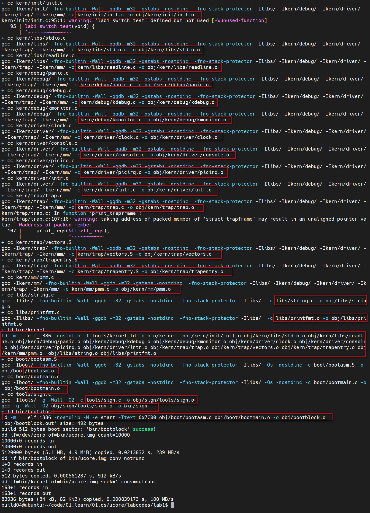

结合Makefile与function.mk的内容我们来看

按照Makefile的格式

```
targets : prerequisites
    command
```

我们可以顺藤摸瓜的找一下调用链：

TARGETS :=

TARGETS: $(TARGETS)

TARGETS += $$(__temp_target__)

__temp_target__ = $(call totarget,$(1))

totarget = $(addprefix $(BINDIR)$(SLASH),$(1))

BINDIR	:= bin

也就是说target是在bin目录生成文件

```
#ls
bootblock  kernel  sign  ucore.img
```

继续看Makefile，找到关于ucore.img的内容

```makefile
# UCOREIMG会在bin目录下生成ucore.img，需要kernel与bootblock，
UCOREIMG	:= $(call totarget,ucore.img)
$(UCOREIMG): $(kernel) $(bootblock)
# 输入文件：/dev/zero，个数1000个，输出文件默认
# 输入文件：bootblock，不截短输出文件，输出文件默认
# 输入文件：kernel，不截短输出文件，输出文件默认，从输出文件开头跳过1个块后再开始复制
	$(V)dd if=/dev/zero of=$@ count=10000
	$(V)dd if=$(bootblock) of=$@ conv=notrunc
	$(V)dd if=$(kernel) of=$@ seek=1 conv=notrunc
$(call create_target,ucore.img)
```

/dev/null，或称空设备，是一个特殊的设备文件，它丢弃一切写入其中的数据（但报告写入操作成功），读取它则会立即得到一个EOF。

 /dev/zero 是一个特殊的文件，当你读它的时候，它会提供无限的空字符(NULL, ASCII NUL, 0x00)

也就是说，这段会把bootblock编译好的kernel和bootblock写入ucore.img文件中

看kernel的内容：

```makefile
# create kernel target
# 在bin目录生成kernel文件
kernel = $(call totarget,kernel)

# 需要tools/kernel.ld
$(kernel): tools/kernel.ld

# 需要KOBJS
$(kernel): $(KOBJS)
	@echo + ld $@
	$(V)$(LD) $(LDFLAGS) -T tools/kernel.ld -o $@ $(KOBJS)
	@$(OBJDUMP) -S $@ > $(call asmfile,kernel)
	@$(OBJDUMP) -t $@ | $(SED) '1,/SYMBOL TABLE/d; s/ .* / /; /^$$/d' > $(call symfile,kernel)
$(call create_target,kernel)
```

执行逻辑：

```
ld -m    elf_i386 -nostdlib -T tools/kernel.ld -o bin/kernel  obj/kern/init/init.o obj/kern/libs/stdio.o obj/kern/libs/readline.o obj/kern/debug/panic.o obj/kern/debug/kdebug.o obj/kern/debug/kmonitor.o obj/kern/driver/clock.o obj/kern/driver/console.o obj/kern/driver/picirq.o obj/kern/driver/intr.o obj/kern/trap/trap.o obj/kern/trap/vectors.o obj/kern/trap/trapentry.o obj/kern/mm/pmm.o  obj/libs/string.o obj/libs/printfmt.o
```

bootblock

Makefile里面的内容：

```makefile
# create bootblock
bootfiles = $(call listf_cc,boot)
$(foreach f,$(bootfiles),$(call cc_compile,$(f),$(CC),$(CFLAGS) -Os -nostdinc))

bootblock = $(call totarget,bootblock)

$(bootblock): $(call toobj,$(bootfiles)) | $(call totarget,sign)
	@echo + ld $@
	$(V)$(LD) $(LDFLAGS) -N -e start -Ttext 0x7C00 $^ -o $(call toobj,bootblock)
	@$(OBJDUMP) -S $(call objfile,bootblock) > $(call asmfile,bootblock)
	@$(OBJCOPY) -S -O binary $(call objfile,bootblock) $(call outfile,bootblock)
	@$(call totarget,sign) $(call outfile,bootblock) $(bootblock)

$(call create_target,bootblock)
```

dfdafa

执行的逻辑：

```
ld -m    elf_i386 -nostdlib -N -e start -Ttext 0x7C00 obj/boot/bootasm.o obj/boot/bootmain.o -o obj/bootblock.o
```

1、先创建一个数量为10000，大小为默认512bytes即5.12M大小的ucore.img的空文件

2、把bin下面的bootblock拷贝进这个ucore.img文件（bootblock大小为512bytes）

3、把bin下面的kernel拷贝进这个ucore.img文件（kernel大小为78912bytes）

这样，创建出来一个第一个扇区（512bytes）为bootblock（启动引导），然后跟着0x55AA，再之后就是kernel。

#### 一个被系统认为是符合规范的硬盘主引导扇区的特征是什么？

大小512字节，最近两个是 0x55AA。

可以看sign.c此函数

下面这些是GCC的一些参数作用：

- -ggdb 生成可供gdb使用的调试信息

- -m32 生成适用于32位环境的代码

- -gstabs 生成stabs格式的调试信息

- -nostdinc 不使用标准库

- -fno-stack-protector 不生成用于检测缓冲区溢出的代码

- -Os 为减小代码大小而进行优化

- -I添加搜索头文件的路径

- -fno-builtin 不进行builtin函数的优化

- -m 模拟为i386上的连接器

- -N 设置代码段和数据段均可读写

- -e 指定入口

- -Ttext 指定代码段开始位置

  

### 练习2：使用qemu执行并调试lab1中的软件

首先在环境配置好，之前，可以执行`sudo make debug`的命令，即可开启调试，`tools/gdbinit`里面的内容为：

```
file bin/bootblock

set architecture i8086
target remote :1234

b *0x7c00
```

执行`sudo make debug`后

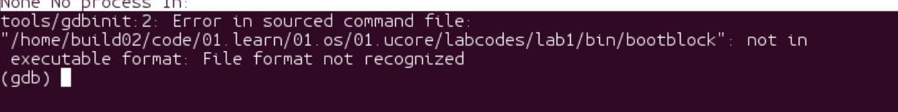

报这个错是因为bootblock不是elf格式，需要再通过执行`target remote:1234`，可以看到：

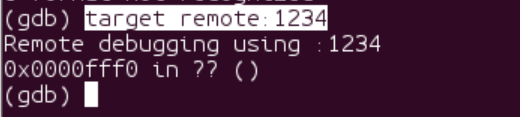

可以看到CS:EIP的内容：

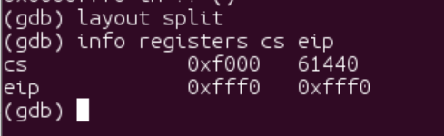

CS：EIP指向：0xffff0

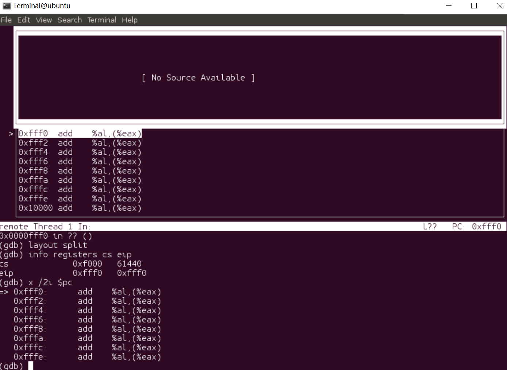

通过指令：`b *0x7c00`可以把断点打到：0x7c00处：

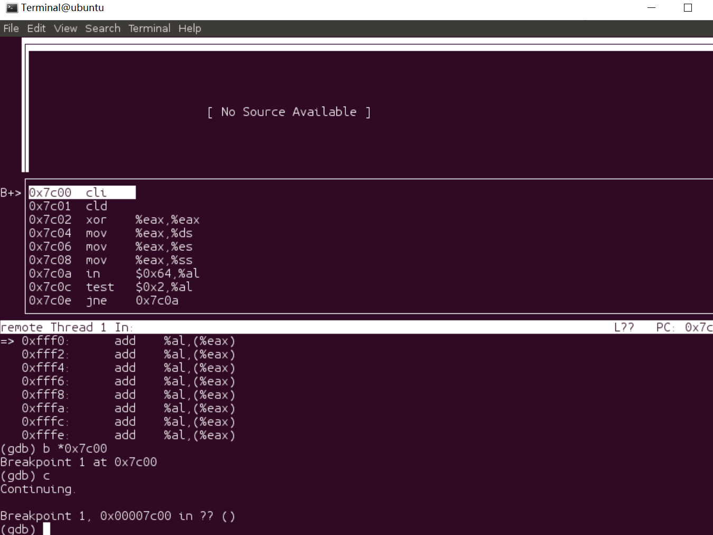

可以看到0x7c00处的代码就是boot/bootasm.S里面的代码：

```assembly
# start address should be 0:7c00, in real model, the beginning address of thre running bootloader
.globl start
start:
.code16                                             # Assemble for 16-bit mode
    cli                                             # Disable interrupts
    cld                                             # String operations increment

    # Set up the important data segment registers (DS, ES, SS).
    xorw %ax, %ax                                   # Segment number zero
    movw %ax, %ds                                   # -> Data Segment
    movw %ax, %es                                   # -> Extra Segment
    movw %ax, %ss                                   # -> Stack Segment
```

通过一步步执行可以看到，后面会从汇编指令调用C的函数：

```assembly
    # Set up the stack pointer and call into C. The stack region is from 0--start(0x7c00)
    movl $0x0, %ebp
    movl $start, %esp
    call bootmain
```

可以看到

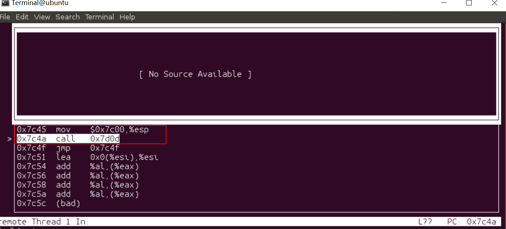

可以看到`call 0x7d0d`调用到bootmain。

当然前面的指令做了很多工作，比如开启A20，加载全局描述符表等


### 练习3：分析bootloader进入保护模式的过程。

#### 首先什么是A20：

在Intel的早期处理器中，地址总线有20位A0~A19。处理器能访问2^20bytes=1,048,576=1,048,576/512=1024KB=1MB，也就是说能访问1MB的空间。然而，地址寄存器能访问的是16位。这样要访问1MB的空间就需要做一些特殊的处理。通过两个寄存器（CS、IP），CS左移4位+IP（*segment* × 16 + *offset*.）就刚好20位，这样就可以访问20位的地址总线。1MB的16位表示为：0x100000

而因为内存地址是0x00000000~0x000FFFFF所以当访问0x000FFFFF+1，这个地址，物理地址是不存在的。此时就要通过"wrap around"去指向物理地址：0x00000000。

而后续的处理器80286 ，内存达到16MB，且有了实模式，此时访问0x000FFFFF+1就可以访问到0x100000。但是这样有个问题就是之前支持8086系列处理器的代码（wrap around）可能就不能正常工作。所以为了解决这个问题，在处理器和系统总线之间在20 line处加了一个逻辑门，即：**Gate-A20**

A20可以被软件来开启或者阻止。在计算机启动时，BIOS会先开启（Enable）A20，去检测所有的系统内存，在把控制权交给操作系统之前disabled。

#### 为何开启A20，以及如何开启A20

开启A20后能正常访问>1MB的地址空间，如何开启，可以看bootasm.S代码：

```assembly
    # Enable A20:
    #  For backwards compatibility with the earliest PCs, physical
    #  address line 20 is tied low, so that addresses higher than
    #  1MB wrap around to zero by default. This code undoes this.

seta20.1:
    inb $0x64, %al                                  # Wait for not busy(8042 input buffer empty).
    testb $0x2, %al                                 # 如果 %al 第低2位为1，则ZF = 0, 则跳转
    jnz seta20.1                                    # 如果 %al 第低2位为0，则ZF = 1, 则不跳转

    movb $0xd1, %al                                 # 0xd1 -> port 0x64
    outb %al, $0x64                                 # 0xd1 means: write data to 8042's P2 port

seta20.2:
    inb $0x64, %al                                  # Wait for not busy(8042 input buffer empty).
    testb $0x2, %al
    jnz seta20.2

    movb $0xdf, %al                                 # 0xdf -> port 0x60
    outb %al, $0x60                                 # 0xdf = 11011111, means set P2's A20 bit(the 1 bit) to 1
```

看8042键盘控制器：


8042 键盘控制器的 IO 端口是 0x60 ～ 0x6f，实际上 IBM PC/AT 使用的只有 0x60 和 0x64 两个端口（0x61、0x62 和 0x63 用于与 XT 兼容目的）。8042 通过这些端口给键盘控制器或键盘发送命令或读取状态。位 1（P21 引脚）用户控制 A20 信号线的开启与否。系统向输入缓冲（端口 0x64）写入一个字节，即发送一个键盘控制器命令。可以带一个参数。参数是通过 0x60 端口发送的。 命令的返回值也从端口 0x60 去读。

#### 如何初始化GDT表

```assembly
    # 通过lgdt指令把gdtdesc的地址载入到gdtr
    lgdt gdtdesc
    
# Bootstrap GDT
.p2align 2                                          # force 4 byte alignment
gdt:
    SEG_NULLASM                                     # null seg
    SEG_ASM(STA_X|STA_R, 0x0, 0xffffffff)           # code seg for bootloader and kernel
    SEG_ASM(STA_W, 0x0, 0xffffffff)                 # data seg for bootloader and kernel

gdtdesc:
    .word 0x17                                      # sizeof(gdt) - 1
    .long gdt                                       # address gdt

```

而GDT表的内容可以结合全局描述符表的结构分析代码`asm.h`中的两个宏定义：`SEG_NULLASM`和`SEG_ASM`

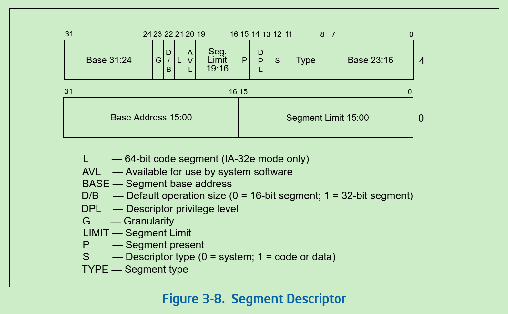

可以看到，GDT为64bits，也就是8个字节。看一下代码里面关于段描述符的数据结构定义：

```c
/* segment descriptors */
struct segdesc {
    unsigned sd_lim_15_0 : 16;        // low bits of segment limit
    unsigned sd_base_15_0 : 16;        // low bits of segment base address
    unsigned sd_base_23_16 : 8;        // middle bits of segment base address
    unsigned sd_type : 4;            // segment type (see STS_ constants)
    unsigned sd_s : 1;                // 0 = system, 1 = application
    unsigned sd_dpl : 2;            // descriptor Privilege Level
    unsigned sd_p : 1;                // present
    unsigned sd_lim_19_16 : 4;        // high bits of segment limit
    unsigned sd_avl : 1;            // unused (available for software use)
    unsigned sd_rsv1 : 1;            // reserved
    unsigned sd_db : 1;                // 0 = 16-bit segment, 1 = 32-bit segment
    unsigned sd_g : 1;                // granularity: limit scaled by 4K when set
    unsigned sd_base_31_24 : 8;        // high bits of segment base address
};
```

宏定义代码：

```assembly
/* Normal segment */
#define SEG_NULLASM                                             \
    .word 0, 0;                                                 \
    .byte 0, 0, 0, 0

#define SEG_ASM(type,base,lim)                                  \
    .word (((lim) >> 12) & 0xffff), ((base) & 0xffff);          \
    .byte (((base) >> 16) & 0xff), (0x90 | (type)),             \
        (0xC0 | (((lim) >> 28) & 0xf)), (((base) >> 24) & 0xff)
```

SEG_NULLASM为一个空的GDT表，而后面的宏定义我们可以写的更直观一点，如下图所示：


然后我们看代码段：SEG_ASM(STA_X|STA_R, 0x0, 0xffffffff) 

STA_X|STA_R = 0x8 | 0x2 = 00001000 | 00000010 =  00001010 = 0x0A，代入宏定义里面得：

(0xC0 | (((0xffffffff) >> 28) & 0xf))

11111111111111111111111111111111 >> 28 = 1111
(11000000 | (1111 & 1111) = (11000000 | 1111) = (11001111) = 0xCF

(0x90|0xA) = (10010000 | 00001010) = (10011010) = 0x9A

最后得出代码段的结构为：

```
11111111 11001111 10011010 11111111
11111111 11111111 11111111 11111111
```

数据段的结构为：

```
11111111 11001111 10010010 11111111
11111111 11111111 11111111 11111111
```

可以看到两者的差异为TYPE不同，TYPE 字段共 4 位，用于指示描述符的子类型，或者说是类别。

对于数据段来说， 这 4 位分别是 X、 E、 W、 A 位；而对于代码段来说，这 4 位则分别是 X、 C、 R、 A 位。如下表所示


代码段的TYPE为：1010（执行、读）

数据段的TYPE为：0010（只读，向下扩展）

三个段结构为：

```
# NULL SEGMENT
00000000 00000000 00000000 00000000
00000000 00000000 00000000 00000000
# CODE SEGMENT
11111111 11001111 10011010 11111111
11111111 11111111 11111111 11111111
# DATA SEGMENT
11111111 11001111 10010010 11111111
11111111 11111111 11111111 11111111
```


#### 如何使能和进入保护模式

使能和进入保护模式的代码：

```assembly
    movl %cr0, %eax
    orl $CR0_PE_ON, %eax
    movl %eax, %cr0
```

CR0是32位的控制寄存器，在Intel的手册里面可以找到：

> The control registers (CR0, CR2, CR3, and CR4) contain a variety of flags and data fields for controlling system-level operations. Other flags in these registers are used to indicate support for specific processor capabilities within the operating system or executive. See also: Section 2.5, “Control Registers.”  

CR0-CR4都是控制寄存器，包含有几个标志变更和数据来控制系统级别的操作。这些寄存器的其他标志用来支持特定的处理能力。

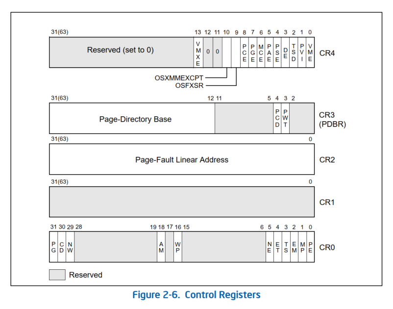

​	单独看CR0寄存器：

​	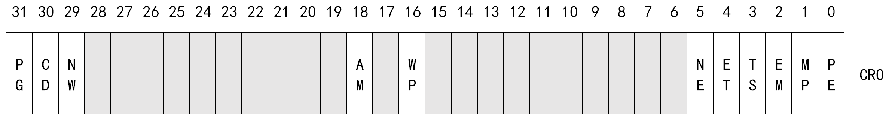

Reserved是被保留的。

第0位（PE）就是**Protected-Mode Enable (PE) Bit**. 

PE=0表示CPU处于实模式；PE=1表CPU处于保护模式，并使用分段机制。也就是说，只要把CR0的PE位置为1就可以使能和进入保护模式。

第31位（PG)就是**Paging Enable(PG)Bit.**控制分页机制（后面的实验会开启分页机制）

PG=1表示启动分页机制；PG=0表示不使用分页机制

下图为IA-32 System-Level Registers and Data Structures（IA-32系统级别寄存器和数据结构）：

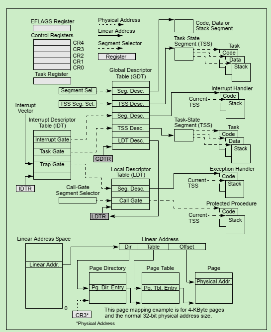


### 练习4：分析bootloader加载ELF格式的OS的过程。

通过这一步对从硬盘读数据形成初步了解

#### bootloader如何读取硬盘扇区的？

`bootasm.S`的代码`call bootmain`会从汇编调到`bootmain.c`的bootmain函数

```c
/* bootmain - the entry of bootloader */
void
bootmain(void) {
    // read the 1st page off disk
    // 从硬盘读第一页（第一个扇区）
    readseg((uintptr_t)ELFHDR, SECTSIZE * 8, 0);

    // is this a valid ELF?
    // 通过检测magic值来确定是不是ELF文件，如果不是ELF走bad的条件分支
    if (ELFHDR->e_magic != ELF_MAGIC) {
        goto bad;
    }

    struct proghdr *ph, *eph;

    // load each program segment (ignores ph flags)
    ph = (struct proghdr *)((uintptr_t)ELFHDR + ELFHDR->e_phoff);
    eph = ph + ELFHDR->e_phnum;
    for (; ph < eph; ph ++) {
        readseg(ph->p_va & 0xFFFFFF, ph->p_memsz, ph->p_offset);
    }

    // call the entry point from the ELF header
    // note: does not return
    ((void (*)(void))(ELFHDR->e_entry & 0xFFFFFF))();

bad:
    outw(0x8A00, 0x8A00);
    outw(0x8A00, 0x8E00);

    /* do nothing */
    while (1);
}
```

`readseg`函数就是从硬盘读数据，结合传进去的3个参数

```c
// 第1个参数
#define ELFHDR          ((struct elfhdr *)0x10000)      // scratch space
// 第2个参数 SECTSIZE*8 = 512*8 = 4096 = 0x1000
#define SECTSIZE        512
// 第3个参数  offset = 0
static void
readseg(uintptr_t va, uint32_t count, uint32_t offset) {
    
    // end_va即虚拟地址的结束 0x10000+0x1000 = 0x11000
    uintptr_t end_va = va + count;

    // 向下舍入到扇区边界 0%512=0
    // round down to sector boundary
    va -= offset % SECTSIZE;

    // translate from bytes to sectors; kernel starts at sector 1
    // (0/512)+1 = 1
    uint32_t secno = (offset / SECTSIZE) + 1;

    // If this is too slow, we could read lots of sectors at a time.
    // We'd write more to memory than asked, but it doesn't matter --
    // we load in increasing order.
    // va 从0开始，每循环一次加512
    for (; va < end_va; va += SECTSIZE, secno ++) {
        readsect((void *)va, secno);
    }
}
```

接下来就是`readsect`函数来读取扇区的数据，前面简单提到过硬盘访问的

```c
/* readsect - read a single sector at @secno into @dst */
// dst 即把内容读到这个地址
// secno 扇区号
static void
readsect(void *dst, uint32_t secno) {
    // wait for disk to be ready
    waitdisk();

    // 读写1个扇区
    outb(0x1F2, 1);                         // count = 1
    // LBA参数的0-7位：1 & 11111111 = 00000001
    outb(0x1F3, secno & 0xFF);
    // LBA参数的8-15位：(1 >> 8) & 11111111 = 00000000
    outb(0x1F4, (secno >> 8) & 0xFF);
    // LBA参数的16-23位：(1 >> 16) & 11111111 = 00000000
    outb(0x1F5, (secno >> 16) & 0xFF);
    // 第0~3位：如果是LBA模式就是24-27位 第4位：为0主盘；为1从盘
    // LBA参数的24-27位：(1 >> 24) & 11100000 = 000xxxxx
    outb(0x1F6, ((secno >> 24) & 0xF) | 0xE0);
    // 写入0x20表示请求读硬盘
    outb(0x1F7, 0x20);                      // cmd 0x20 - read sectors

    // wait for disk to be ready
    waitdisk();

    // read a sector
    insl(0x1F0, dst, SECTSIZE / 4);
}

/* waitdisk - wait for disk ready */
// 如果 (inb(0x1F7) & 0xC0) != 40，那么就一直等
// inb是IO操作的指令，inb 从I/O端口读取一个字节(BYTE, HALF-WORD) ;inb(0x1F7)是从0x1F7读取一个字节的数据，然后与0xC0，0xC0 = 11000000, 0x40 = 01000000
// 0x1F7状态和命令寄存器。操作时先给命令，再读取，如果不是忙状态就从0x1f0端口读数据
// 既是命令端口，又是状态端口。作为命令端口时，写入0x20表示请求读硬盘；写入0x30表示请求写硬盘。作为状态端口时，第0位为1表示前一个命令执行错误，具体原因可访问端口0x1f1；第3位为1表示硬盘已经准备好和主机进行数据交互；第7位为1表示硬盘忙。
// 0x40（01000000）二进制的第7位为1，所以只要硬盘忙，就会什么也不做，一直循环，当第7位为0时，就可以从硬盘读数据
static void
waitdisk(void) {
    while ((inb(0x1F7) & 0xC0) != 0x40)
        /* do nothing */;
}

// 内联汇编
// inb函数内联了inb指令，用于从指定端口读取1字节数据。
// outb函数内联了outb指令，用于向指定端口写入1字节数据。
static inline uint8_t
inb(uint16_t port) {
    uint8_t data;
    asm volatile ("inb %1, %0" : "=a" (data) : "d" (port));
    return data;
}

// 内联汇编
// insl函数内联了cld; rep insl指令，cld用于清除方向标志，使偏移量向正方向移动，这个偏移量其实就是传入的addr，会被关联到edi，反汇编的结果中可以看到，请大家自己实验。rep前缀用于重复执行insl，重复的次数由ecx决定，即传入的参数cnt。最终数据会被连续读取到addr指向的内存处。
// CLD与STD是用来操作方向标志位DF（Direction Flag）。CLD使DF复位，即DF=0，STD使DF置位，即DF=1.用于串操作指令中。
// repne 不等于时重复 
// insl(0x1F0, dst, SECTSIZE / 4);
// 0x1F0读数据
// dst目标地址
// cnt 重复次数
static inline void
insl(uint32_t port, void *addr, int cnt) {
    asm volatile (
            "cld;"
            "repne; insl;"
            : "=D" (addr), "=c" (cnt)
            : "d" (port), "0" (addr), "1" (cnt)
            : "memory", "cc");
}
```

我们看硬盘访问概述里所讲：

一般主板有2个IDE通道，每个通道可以接2个IDE硬盘。访问第一个硬盘的扇区可设置IO地址寄存器0x1f0-0x1f7实现的，具体参数见下表。一般第一个IDE通道通过访问IO地址0x1f0-0x1f7来实现，第二个IDE通道通过访问0x170-0x17f实现。每个通道的主从盘的选择通过第6个IO偏移地址寄存器来设置。


| IO地址 | 功能                                                         |
| ------ | ------------------------------------------------------------ |
| 0x1f0  | 读数据，当0x1f7不为忙状态时，可以读。<br />`16`位数据端口，用于读取或写入数据，每次读写`1`个字，循环直到读完所有数据。 |
| 0x1f1  | 读取时的错误信息或写入时的额外参数。                         |
| 0x1f2  | 要读写的扇区数，每次读写前，你需要表明你要读写几个扇区。最小是1个扇区 |
| 0x1f3  | 如果是LBA模式，就是LBA参数的0-7位                            |
| 0x1f4  | 如果是LBA模式，就是LBA参数的8-15位                           |
| 0x1f5  | 如果是LBA模式，就是LBA参数的16-23位                          |
| 0x1f6  | 第0~3位：如果是LBA模式就是24-27位 第4位：为0主盘；为1从盘<br />低`4`位保存`LBA`地址的前`4`位，高`4`位指定访问模式和访问的设备。其中第`4`位指示硬盘号，`0`表示主盘，`1`表示从盘；第`6`位指定访问模式，`0`表示`CHS 模式`，`1`表示`LBA 模式`。第`5、7`位为`1`。 |
| 0x1f7  | 状态和命令寄存器。操作时先给命令，再读取，如果不是忙状态就从0x1f0端口读数据<br />既是命令端口，又是状态端口。作为命令端口时，写入`0x20`表示请求读硬盘；写入`0x30`表示请求写硬盘。作为状态端口时，第`0`位为`1`表示前一个命令执行错误，具体原因可访问端口`0x1f1`；第`3`位为`1`表示硬盘已经准备好和主机进行数据交互；第`7`位为`1`表示硬盘忙。 |


#### Bootloader是如何加载ELF格式的OS？

在bootmain.c的bootmain方法中，当从硬盘读完数据后有下面的代码

```c
void
bootmain(void) {
    ......
    struct proghdr *ph, *eph;

    // load each program segment (ignores ph flags) 加载每个程序的段
    // e_phoff -> file position of program header or 0，
    // ph 即指向program header
    ph = (struct proghdr *)((uintptr_t)ELFHDR + ELFHDR->e_phoff);
    // e_phnum(入口个数)：number of entries in program header or 0
    // 
    // proghdr:program section header
    // 读进对应的地址ph->p_va。
    for (; ph < eph; ph ++) {
        readseg(ph->p_va & 0xFFFFFF, ph->p_memsz, ph->p_offset);
    }

    // call the entry point from the ELF header
    // note: does not return
    ((void (*)(void))(ELFHDR->e_entry & 0xFFFFFF))();
    ......
}
```

所以大概可以看到bootmain函数的流程大概如下：

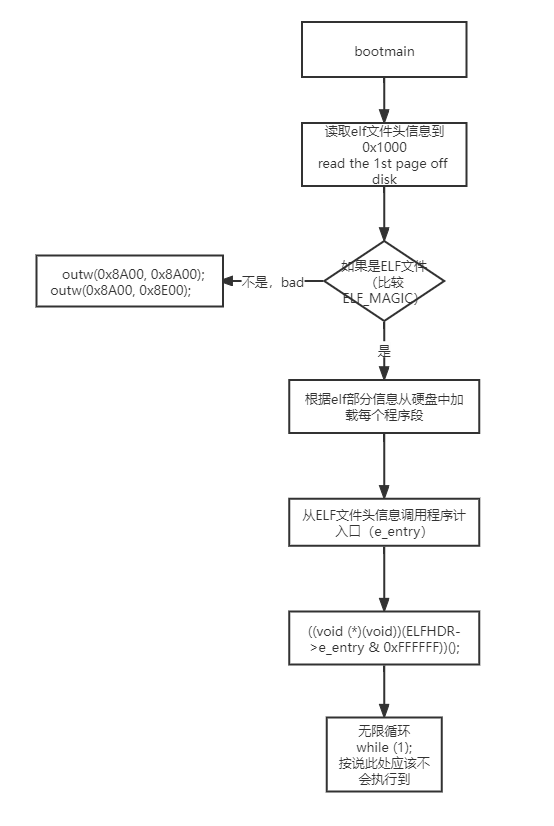

而这个入口就是kern/init.c里面的kern_init函数，从tools/kernel.ld文件中也可以看到有：

```ld
ENTRY(kern_init)
```

*后面需要好好学习一下编译原理*

#### 练习5：实现函数调用堆栈跟踪函数 （需要编程）

ESP：栈指针寄存器（extended stack pointer），其内存放着一个指针，该指针永远指向系统栈最上面一个栈帧的栈顶。

EBP：基址指针寄存器（extended base pointer），其内存放着一个指针，该指针永远指向系统栈最上面一个栈帧的底部。

参考课程资料，及C的函数调用分析，完成后的代码如下：

```c
void
print_stackframe(void) {
    // 通过内联汇编读取ebp、eip的值
    uint32_t ebp = read_ebp();
    uint32_t eip = read_eip();

    // STACKFRAME_DEPTH = 20，也就是最多打印20个调用栈,且因为刚开始（第一个）调用开始时ebp = 0，所以这里要保证调用不会溢出
    int index;
    for (index = 0; index < STACKFRAME_DEPTH && ebp != 0; index++) {
        
        // ebp eip 
        printf("ebp = 0x%08x\t eip = 0x%08x\t", ebp, eip);
        // arguments 一般而言，ss:[ebp+4]处为返回地址，ss:[ebp+8]处为第一个参数值
        // 而我们这里uint32_t占4个字节，根据C指针的特性，ebp指针+2就是第一个参数，
        // 这样我们可以定义一个长度为4的数据，这样依次就对应1、2、3、4参数
        uint32_t args[4] = (uint32_t)ebp + 2;
        printf("args:0x%80x\t0x%80x\t0x%80x\t0x%80x\t", args[0], args[1], args[2], args[3]);
        printf("\n");
        print_debuginfo(eip-1);
        // 如果eip的值转化为指针，那么这个指针指向的就是caller函数（当前函数的调用者）的ebp
        // 对应的指针+1就是返回值（保存调用者要执行的地址）
        ebp = ((uint32_t *)ebp)[0];
        eip = ((uint32_t *)ebp)[1];
    }
}
```


### 练习6：完善中断初始化和处理 （需要编程）

#### 中断描述符表（也可简称为保护模式下的中断向量表）中一个表项占多少字节？其中哪几位代表中断处理代码的入口？

先看一下中断描述符表的结构（分三类：Task Gate、Interrupt Gate、Trap Gate）（参考Intel的手册）：

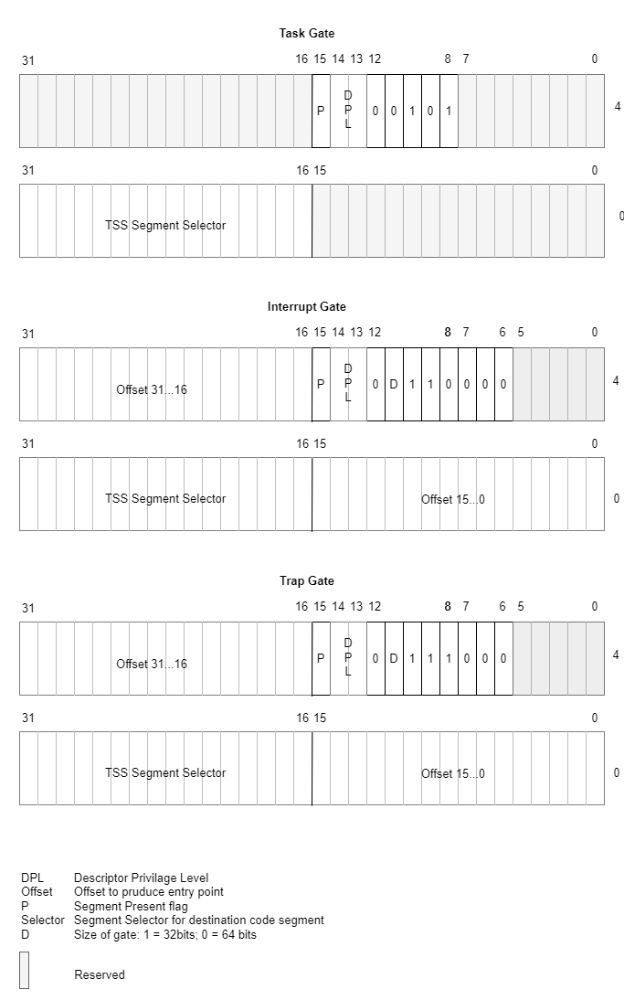

然后是不同的描述符：

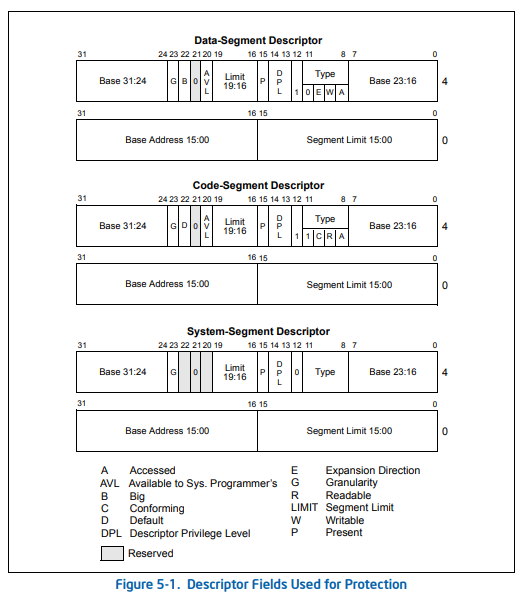

可以看到，中断描述符表一个表项占有8个字节，

段选择子->LDT->找到Base Address + Offset可以找到中断服务例程的入口地址。


#### 请编程完善kern/trap/trap.c中对中断向量表进行初始化的函数idt_init。在idt_init函数中，依次对所有中断入口进行初始化。使用mmu.h中的SETGATE宏，填充idt数组内容。每个中断的入口由tools/vectors.c生成，使用trap.c中声明的vectors数组即可。

代码如下：

```c
void
idt_init(void) {
      // 根据提示，首先要__vectors，extern是外部变量声明，__vectors是通过tools/vector.c生成的vectors.S里面定义的
      extern uintptr_t __vectors[];
      // 对2562个中断向量表初始化
      int i;
      for (i = 0; i < (sizeof(idt) / (sizeof(struct gatedesc))); i++)
      {
        // idt数据里面的每一个，也可以用指针表示，
        // 0表示是一个interrupt gate
        // segment selector设置为GD_KTEXT（代码段）
        // offset设置为__vectors对应的内容
        // DPL设置为0
        SETGATE(idt[i], 0, GD_KTEXT, __vectors[i], DPL_KERNEL);
      }

      // 再把从用户态切换到内核态使用的Segment Descriptor改一下
      // 需要注意的是，我们使用的segment都是一样的，都是GD_KTEXT
      // 而有一点不同的是这里的DPL是DPL_USER，即从user->kernel时，需要的该段的权限级别
      // 因为Privilege Check需要满足：DPL >= max {CPL, RPL} 
      // 所以如果不单独改这个会造成Privilege Check失败，无法正确处理user->kernel的流程
      SETGATE(idt[T_SWITCH_TOK], 0, GD_KTEXT, __vectors[T_SWITCH_TOK], DPL_USER);

      // 通过lidt加载
      lidt(&idt_pd);
}

    // 通过lidt加载
    lidt(&idt_pd);
}
```


#### 请编程完善trap.c中的中断处理函数trap，在对时钟中断进行处理的部分填写trap函数中处理时钟中断的部分，使操作系统每遇到100次时钟中断后，调用print_ticks子程序，向屏幕上打印一行文字”100 ticks”。

这个相对简单，累计100次打印即可

代码如下：

```c
    case IRQ_OFFSET + IRQ_TIMER:
        /* LAB1 YOUR CODE : STEP 3 */
        /* handle the timer interrupt */
        /* (1) After a timer interrupt, you should record this event using a global variable (increase it), such as ticks in kern/driver/clock.c
         * (2) Every TICK_NUM cycle, you can print some info using a funciton, such as print_ticks().
         * (3) Too Simple? Yes, I think so!
         */
        ticks++;
        if (ticks % 100 == 0) {
            print_ticks();
        }
        break;
```


### 扩展练习 Challenge 1（需要编程）

这道题难度太大，一点提示也没有，只能各种查资料，并且看答案来理解。

#### 准备知识

为了更好的保护好多个任务，80386使用了几种特别的数据结构。但是，并没有使用特别的指令来控制
多任务。相反，当遇到转移指令是访问的特别的数据结构时，它用不同的方法来解析控制转移。用来控
制多任务的寄存器和数据结构是：
1、 任务状态段（Task state segment）
2、 任务状态段描述符（Task state segment descriptor）
3、 任务寄存器（Task register）
4、 任务门描述符（Task gate descriptor）
有了这些数据结构，80386可以快速的从一个任务切换到另一个任务中去，把原先任务的上下文
（context）保存起来，以便以后可以重起该任务。除了任务切换以外，80386还进行以下两个任务管
理：
1、 中断和异常可以引起任务切换（如果系统设计需要的话）。处理器不但切换到中断处理程序的任务
中，而且当中断处理完后还会自动返回原任务。中断任务可以中断低特权级的任务，无论多少级。
2、 当每一次切换到另一个任务时，80386也会切换到另一个LDT和另一个页目录去。这样，每个任务都
有了不同的逻辑地址——线性地址，和线性地址——物理地址的映射了。这是另一个保护的特性，它把
任务独立开来，以防止它们之间的相互干涉。  

需要从Intel手册里面了解的知识：

##### （01）任务状态段（Task State Segment）  

一个任务由两部分构成：任务执行的空间和TSS（Task-State Segment）。而任务执行的空间则由：代码段（Code Segment）、数据段（一个或者多个）（Data Segment）、栈段（Stack Segment）组成。

TSS存储了处理器管理任务所需要的信息（也就是把寄存器里面的内容都保存下来）。结构如下图指所示：

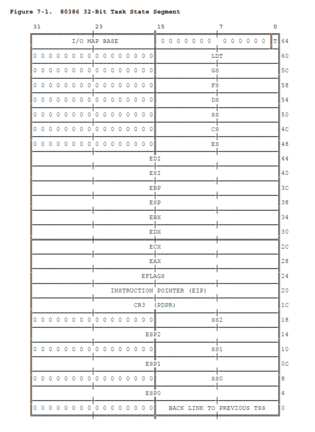

可以看到和我们代码里面的trapframe结构是很相似的。

```c
/* registers as pushed by pushal */
struct pushregs {
    uint32_t reg_edi;
    uint32_t reg_esi;
    uint32_t reg_ebp;
    uint32_t reg_oesp;            /* Useless */
    uint32_t reg_ebx;
    uint32_t reg_edx;
    uint32_t reg_ecx;
    uint32_t reg_eax;
};

struct trapframe {
    struct pushregs tf_regs;
    uint16_t tf_gs;
    uint16_t tf_padding0;
    uint16_t tf_fs;
    uint16_t tf_padding1;
    uint16_t tf_es;
    uint16_t tf_padding2;
    uint16_t tf_ds;
    uint16_t tf_padding3;
    uint32_t tf_trapno;
    /* below here defined by x86 hardware */
    uint32_t tf_err;
    uintptr_t tf_eip;
    uint16_t tf_cs;
    uint16_t tf_padding4;
    uint32_t tf_eflags;
    /* below here only when crossing rings, such as from user to kernel */
    uintptr_t tf_esp;
    uint16_t tf_ss;
    uint16_t tf_padding5;
} __attribute__((packed));
```

###### **TSS 的字段属于两类：** 

1. 处理器在每次切换时更新的动态集 任务。该集合包括存储的字段： 

   * 通用寄存器（EAX、ECX、EDX、EBX、ESP、EBP、ESI、EDI）。

   * 段寄存器（ES、CS、SS、DS、FS、GS）。 

   * 标志寄存器(EFLAGS)。 

   * 指令指针（EIP）。

   * 之前执行任务的 TSS 的选择器（仅在会返回时更新）。

2. 处理器读取但不会更改的静态集。这套 包括存储的字段：

   * DGT或者LDT的选择子（Selector）
   * 包含任务页面目录（仅在启用分页时读取）的基地址寄存器（PDBR）（在lab1我们不会关注到）
   * 指向特权级别 0-2 的堆栈的指针。（在lab1我们不会关注到）
   * T 位（调试陷阱位）导致处理器产生一个 发生任务切换时的调试异常。 （在lab1我们不会关注到）
   * I/O 映射库（在lab1我们不会关注到）

##### （02）TSS Descriptor

和其他的segment一样，Task State Segment也是被一个描述符定义的，结构如下所示：

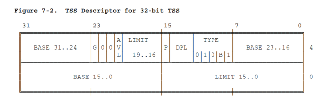

TYPE里面的B代表是否busy，9 = 1001，B = 0，代表空闲，11 = 1011，B = 1，代表忙。task不可重入，处理器可以根据这个位的值来判断。

BASE、LIMIT、DPL、G这些和其他的描述符差不多。而LIMIT，必需>=103。如果小于103会引发异常。如果存在 I/O 权限映射，则需要更大的限制。 如果附加数据存储在与 TSS 相同的段中，则更大的LIMIT对系统软件更方便。

一个访问TSS描述符的例程可能会引起一个task切换。多数系统里面DPL需要设置为0，这样只有被信任的软件才有权限执行任务切换。

访问 TSS 描述符并不赋予程序读取或修改 TSS 的权利。 只能通过重新定义一个 TSS作为数据段（data segment）读取和修改。 尝试将 TSS 描述符加载到任何段寄存器（CS、SS、DS、ES、FS、GS）都会引起异常。

TSS描述符只能放在GDT里面，尝试从TI=1的选择子里面（LDT）去导向一个TSS也异常。

##### （03）TaskRegister

任务寄存器（TR）指向当前正在执行的任务的TSS，如下图所示

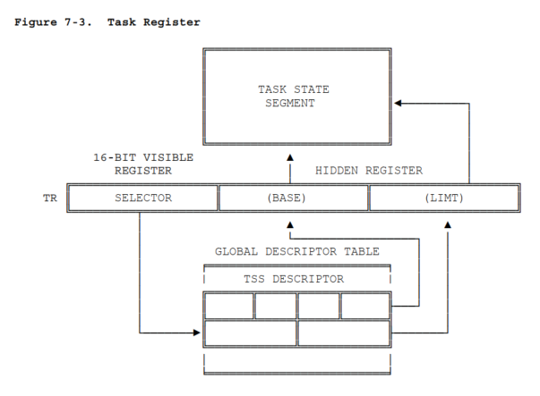

和其他的寄存器一样，分为可见部分和不可见部分。可见部分，通过selector从GDT中，查找到TSS描述符。处理器通过不可见部分缓存TSS描述符的BASE和LIMIT，这样处理器就不需要重复通过index（selector）从内存中获取。

可以通过LTR和STR指令去修改和读取可见部分。这两个指令都采用一个操作数，如16-bit（两个字节的）选择子或通用寄存器。

LTR（Load task register）通过selector operand加载TR寄存器的可见部分（必需能从GDT中找到TSS Descriptor）。LTR指令也可以把根据selector从GDT里面找到的TSS的信息（BASE、LIMIT）加载到不可见部分。且LTR是有权限的，可能只能在CPL为0的时候来执行。

STR (Store task register) 在普通的寄存器或者内存里面存放task register的可见部分，且没有权限级别要求。

可以写一个函数（内联汇编）来记取TR寄存器的selector。

```c

```


##### （04）Task Gate Descriptor  

一个task gate descriptor（任务门描述符）提供一个间接的、受保护的指向TSS的引用。

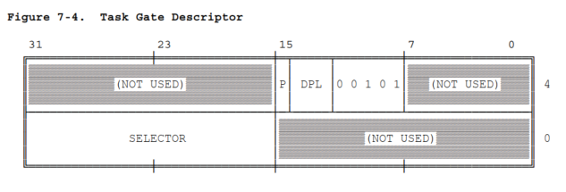

任务门的SELECTOR指向一个TSS描述符。selector里面的RPL并不是被处理器使用。

任务门的DPL字段控制任务切换时使用描述符的权限。除非满足要求：max{RPL, CPL} <= DPL。这样的约束可以防止不被任务的程序（例程）引起任务切换（需要注意，当一个任务门正在使用，目标TSS描述符的DPL不会用来做Privilege Check）。

像可以访问 TSS 描述符的程序一样，可以访问任务门的也可以引起任务切换（task switch）， 除了 TSS 描述符之外，80386 还具有任务门，以满足三个需求：

1、一个任务（task）需要有一个busy-bit。因为busy-bit放在TSS描述符中，而每个任务都需要有一个这样的描述符。然而可能几个任务门（task gate）使用一个TSS descriptor。

2、需要提供访问任务的选择性（GDT、LDT）。任务门满足这一要求，因为任务门放在LDT中，且有一个不同于TSS descriptor的DPL。如果一个例程没有权限访问GDT中的TSS descriptor（GDT中TSS descriptor的DPL通常为0），但能访问其LDT中的task gate，也可以切换到另一个task。

3、需要中断或者异常来引起任务切换。task gate可能在GDT或者LDT（ucore这里都是GDT）中，这样使得使用LDT的task也能引起task switch。当中断或异常向量指向一个包含任务门的IDT，80386也可以正确的切换到指定的任务。因此，系统中的所有任务都可以受益于中断任务隔离所提供的保护

下图说明了LDT（Local Descriptor Table）和IDT（Interrupt Descriptor Table）中的task gate可以确定同一个任务。

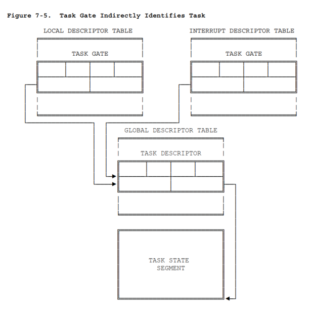

##### （05）Task Switching

80386 在以下四种情况下将切换执行另一个任务：

1. 当前任务执行引用TSS描述符的JMP或者CALL指令。
2. 当前任务执行引用任务门的JMP或者CALL指令。
3. 指向IDT中任务门的中断或者异常。
4. 当前任务在设置NT（Nested Task）标志时执行IRET指令。

一个任务切换过程包含下几个步骤：

1. 检查当前任务是否能切换到指定的任务。JMP或CALL指令需要数据访问特权。也就是TSS描述符或者task gate的DPL需要<=门选择子的CPL和RPL最大值。异常、中断、和IRET指令可以在不管目标TSS描述符或者task gate的DPL的情况下切换任务。
2. 检查新任务的TSS descriptor存在，且LIMIT可用。到目前为止任何错误都发生在传出任务的上下文中。 错误是可以重新启动的，且可以以对应用程序透明的方式进行处理。
3. 保存当前任务的状态。处理器查找当前任务缓存在TR寄存器里面的TSS的基址，且（处理器）拷贝寄存器（EAX, ECX, EDX, EBX, ESP, EBP, ESI,EDI, ES, CS, SS, DS, FS, GS, EFLAGS）的值到当前的TSS里面。TSS 的 EIP 字段指向导致任务切换的指令之后的指令（比如中断INT n指令的下一条指令）。
4. 使用传入任务的 TSS 描述符的选择器加载任务寄存器，将传入任务的 TSS 描述符标记为忙，并设置 MSW 的 TS（任务切换）位。 选择子要么是控制转移指令的操作数（比如 INT $80，那么选择子就是80），要么取自任务门。
5. 从 TSS 加载传入任务（切换后任务）的状态并恢复执行。加载的寄存器是 LDT 寄存器、 标志寄存器、 通用寄存器 EIP、EAX、ECX、EDX、EBX、ESP、EBP、ESI、EDI；段寄存器 ES、CS、SS、DS、FS 和 GS； 和 PDBR。 在此步骤中检测到的任何错误都发生在传入任务的上下文中（也就是trapframe里面的error no）。需要在新任务的第一条指令尚未执行前处理异常。
6. 要满足：CPL <= DPL且RPL <= DPL或者DPL >= max {CPL, RPL} 。

需要注意的是，旧任务的所有状态在任务切换的时候应总是被完整保存下来，以便再切换回来时能够正确恢复执行。

在传入任务（new task）中恢复执行的特权级别不受传出任务（old task）执行时的特权级别的限制或影响。 因为任务被它们各自的地址空间和 TSS 隔离，并且因为可以使用特权规则来防止对 TSS 的不当访问，所以不需要特权规则来约束任务的 CPL 之间的关系。 新任务（new task）以从 TSS 加载的 CS 选择器值的 RPL 指示的特权级别开始执行。

##### （06）指令：INT、IRET、CALL、RET、JMP、LEAVE

* `INT n`会产生中断，Linux里面软中断（Software Interrupt）是`INT 0x80`。 中断号从0~255（也就是 0~2^8-1），ucore代码里面vectors.S可见，练习6时的`extern uintptr_t __vectors[];`即为中断向量号数组。根据中断号索引到IDT里面对应的gate descriptor，对应ucore里面练习6设置的IDT。`INT n`会产生一个`far call`在返回地址前会把一些标志寄存器压栈。`INT n`会把eflags，cs，eip，errorCode压栈，然后跳转到根据中断号索引到的长地址。简要过程如下：

  * 取中断类型码n
  * SS入栈（返回权限发生变化，ucore需要手动压栈）
  * ESP入栈（返回权限发生变化，ucore需要手动压栈）

  * 标志寄存器入栈，IF=0、TF=0

  * CS、IP入栈
  * error no
  * (IP)=(n∗4),(CS)=(n∗4+2)

* `IRET`也就是`Interrupt Return`，[中断服务程序](https://baike.baidu.com/item/中断服务程序/10510195)的最后一条指令。IRET指令将推入堆栈的段地址和偏移地址弹出，使程序返回到原来发生中断的地方。其作用是从中断中恢复中断前的状态，具体作用有如下三点：

  * 恢复[IP](https://baike.baidu.com/item/IP)(instruction pointer)：IP←（（SP）+1:（SP）），SP←SP+2

  * 恢复CS(code segment)：CS←（（SP）+1:（SP））， SP←SP+2

  * 恢复中断前的[PSW](https://baike.baidu.com/item/PSW)(program status word),即恢复中断前的[标志寄存器](https://baike.baidu.com/item/标志寄存器)的状态。

    FR←（（SP）+1:（SP）），SP←SP+2

  * 恢复ESP（返回权限发生变化）

  * 恢复SS（返回权限发生变化）

  以上操作按顺序进行。

  【指令手册原文】

  the IRET instruction pops the return instruction pointer, return code segment selector, and EFLAGS image from the stack to the EIP, CS, and EFLAGS registers, respectively, and then resumes execution of the interrupted program or procedure. If the return is to another privilege level, the IRET instruction also pops the stack pointer and SS from the stack, before resuming program execution.

  IRET指令影响所有标志位。

* `CALL`在C语言的函数调用对应汇编就是call指令，比如：`call   0x101e92 <trap_dispatch+304>`，CALL指令执行时，进行两步操作：

  （1）将程序下一条指令的位置的IP压入[堆栈](https://baike.baidu.com/item/堆栈)中；

  （2）转移到调用的[子程序](https://baike.baidu.com/item/子程序)。

  (CALL近调用，LCALL远调用，CALL 寻址2K空间范围，LCALL 寻址64K空间范围) 先压CS，再压IP。CALL与RET结合使用，当CALL调用的子程序运行到RET命令时，压入堆栈的IP弹出，跳出子程序，执行CALL的下一条语句。

* `RET`指令与CALL结合，程序运行到RET命令时，压入堆栈的IP弹出，跳出子程序，执行CALL的下一条语句。

* `JMP`跳转指令，比如ucore里面执行kernel->user的中断：`INT 0x78`，会根据0x78（120）跳转到vectors.S的

  ```assembly
  .globl vector120
  vector120:
    pushl $0
    pushl $120
    jmp __alltraps
  ```

* `leave`指令

  在CALL执行跳转到一个新的函数（子程序）后，都会执行：

  ```assembly
  push %ebp
  move %esp, %ebp
  ```

  这样的指令，从而根据ebp形成一个函数调用链，且可根据ebp ± n来取变量返回地址等数据。

  而leave就相当于和这两条汇编指令反过来，即：

  ```assembly
  ;在16位汇编下相当于:
  mov %bp, %sp
  pop %bp
   
  ;在32位汇编下相当于:
  mov %ebp, %esp//将ebp指向（ebp内部应当保存一个地址，所谓指向即这个地址对应的空间）的值赋给esp
  pop %ebp 
   
  /* leave指令将EBP寄存器的内容复制到ESP寄存器中，
  以释放分配给该过程的所有堆栈空间。然后，它从堆栈恢复EBP寄存器的旧值。*/
  ```

#### 过程分析

有了对TSS、TR、INT、IRET等知识点的了解再来分析一下ucore里面的`kernel->user`和`user->kernel`的过程

##### 		（7.1）内核态到用户态

由于特权级变化，我们需要手动压栈ss和esp，但是由于其实ucore是没用到ss（因为ucore的内核态、用户态使用相同的代码段、数据段），所以也可以直接通过`sub $0x8, %esp `这样的操作，空出两个位置就可以。

1. 手动压栈`SS`、`ESP`或者`sub $0x8, %esp`

2. `INT 0x78` 

3. 处理器压栈EFLAGS、CS、EIP

4. ucore的vectors.S压栈 Error Code（ucore这里都是0）`pushl $0`和中断向量号：`pushl $120`，然后通过`jmp __alltraps`跳转到trapentry.S的`__alltraps`。

5. 寄存器信息压栈：先压段寄存器（DS->ES->FS->GS），然后`pushal`压栈通用寄存器（EAX, ECX, EDX, EBX, ESP, EBP, ESI, EDI）

6. 修改DS、ES数据段（data segments）为GD_KDATA = 0x10 = 16 = 00010000

7. ESP入栈，传递trapframe指针（push %esp to pass a pointer to the trapframe as an argument to trap()）

8. `call trap`调用trap.c的trap方法再调用到`trap_dispatch`

9. `case T_SWITCH_TOU:`处理

   涉及栈的切换，参考图示：

   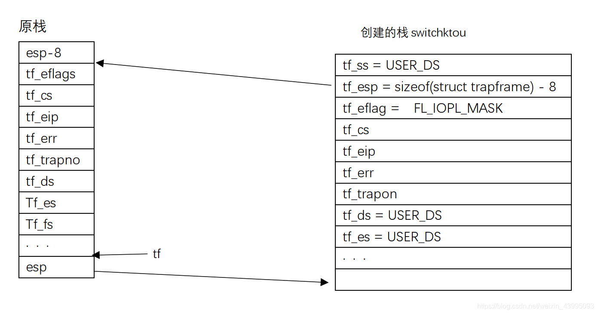

##### 		（7.2）用户态到内核态

1. `INT 0x79`

2. 处理器压栈EFLAGS、CS、EIP

3. ucore的vectors.S压栈 Error Code（ucore这里都是0）`pushl $0`和中断向量号：`pushl $121，然后通过`jmp __alltraps`跳转到trapentry.S的`__alltraps`。

4. 寄存器信息压栈：先压段寄存器（DS->ES->FS->GS），然后`pushal`压栈通用寄存器（EAX, ECX, EDX, EBX, ESP, EBP, ESI, EDI）

5. 修改DS、ES数据段（data segments）为GD_KDATA = 0x10 = 16 = 00010000

6. ESP入栈，传递trapframe指针（push %esp to pass a pointer to the trapframe as an argument to trap()）

7. `call trap`调用trap.c的trap方法再调用到`trap_dispatch`

8. `case T_SWITCH_TOK:`处理

   无栈的切换，参考图示：

   


#### 开始操作

直接亮代码

##### kernel->user

```c
static void
lab1_switch_to_user(void) {

/**
--------------------------------------------------------
	"sub $0x8, %%esp \n" 
	让 SS 和 ESP 这两个寄存器 有机会 POP 出时 更新 SS 和 ESP
	因为 从内核态进入中断 它的特权级没有改变 是不会 push 进 SS 和 ESP的 但是我们又需要通过 POP SS 和 ESP 去修改它们
	进入 T_SWITCH_TOU(120) 中断
	将原来的栈顶指针还给esp栈底指针
--------------------------------------------------------
*/

    //LAB1 CHALLENGE 1 : TODO
    __asm__ __volatile__ (
        "sub $0x8, %%esp \n"
        "INT %0 \n"
        "movl %%ebp, %%esp \n"       // 因为这里主动调INT之后，汇编不会帮我们把类似leave的指令补齐，所以需要我们自己加上去
        :
        :"irq"(T_SWITCH_TOU)
    );

/** 
 * ----------------------------第二种方式-----------------------------------
 * 中断发生前压入的SS实际不会被使用，所以代码中仅仅是压入了%eax占位
 * 主动push esp
 * 	__asm__ __volatile__ (
		"pushl %%eax\n\t"
		"pushl %%esp\n\t"
		"int %0\n\t"
		:
		:"i" (T_SWITCH_TOU)
	);
 * ----------------------------第二种方式-----------------------------------
 * /

/**
--------------------------------------------------------
中断处理例程处于ring 0,所以内核态发生的中断不发生堆栈切换，因此SS、ESP不会自动压栈;
但是是否弹出SS、ESP确实由堆栈上的CS中的特权位决定的。
当我们将堆栈中的CS的特权位设置为ring 3时，IRET会误认为中断是从ring 3发生的，
执行时会按照发生特权级切换的情况弹出SS、ESP。

利用这个特性，只需要手动地将内核堆栈布局设置为发生了特权级转换时的布局，
将所有的特权位修改为DPL_USER,保持EIP、ESP不变，IRET执行后就可以切换为应用态。

因为从内核态发生中断不压入SS、ESP，所以在中断前手动压入SS、ESP。
中断处理过程中会修改tf->tf_esp的值，中断发生前压入的SS实际不会被使用，所以代码中仅仅是压入了%eax占位。

为了在切换为应用态后，保存原有堆栈结构不变，确保程序正确运行，栈顶的位置应该被恢复到中断发生前的位置。
SS、ESP是通过push指令压栈的，压入SS后，ESP的值已经上移了4个字节，所以在trap_dispatch将ESP下移4字节。
为了保证在用户态下也能使用I/O，将IOPL降低到了ring 3。
--------------------------------------------------------
*/
}
```

trap.c

```c
  case T_SWITCH_TOU:
	// 封装一个函数，challenge2还可以复用 
    switch2user(tf);
    break;
/** -------------------------------------------------------- */
void switch2user(struct trapframe *tf)
{
  // eflags
  // 0x3000 = 00110000 00000000
  // 把nested task位置1，也就是可以嵌套
  tf->tf_eflags |= 0x3000;

  // USER_CS = 3 << 3 | 3 = 24 | 3 = 27 = 0x1B = 00011011;
  // 如果当前运行的程序不是在用户态的代码段执行（从内核切换过来肯定不会是）
  if (tf->tf_cs != USER_CS)
  {
    switchk2u = *tf;
    switchk2u.tf_cs = USER_CS;
    // 设置数据段为USER_DS
    switchk2u.tf_ds = switchk2u.tf_es = switchk2u.tf_ss = USER_DS;
    // 因为内存是从高到低，
    // 而这是从内核态切换到用户态（没有ss,sp）
    // (uint32_t)tf + sizeof(struct trapframe) - 8 即 tf->tf_esp的地址
    // 也就是switchk2u.tf_esp，指向旧的tf_esp的值
    switchk2u.tf_esp = (uint32_t)tf + sizeof(struct trapframe) - 8;

    //  eflags 设置IOPL
    switchk2u.tf_eflags | FL_IOPL_MASK;

    // (uint32_t *)tf是一个指针，指针的地址-1就
    // *((uint32_t *)tf - 1) 这个指针指向的地址设置为我们新樊笼出来的tss(switchk2u)

    *((uint32_t *)tf - 1) = (uint32_t)&switchk2u;
  }
}

```


user->kernel

```c
static void
lab1_switch_to_kernel(void) {
    //LAB1 CHALLENGE 1 :  TODO
    // 当内核初始完毕后，可从内核态返回到用户态的函数
    __asm__ __volatile__ (
        "INT %0 \n"
        "movl %%ebp, %%esp \n"
        :
        :"irq"(T_SWITCH_TOK)
    );
}
```

trap.c

```c
  case T_SWITCH_TOK:
    // 同样封装一个函数，challenge2还可以复用 
    switch2kernel(tf);
    break;
/** -------------------------------------------------------- */
void switch2kernel(struct trapframe *tf)
{
  if (tf->tf_cs != KERNEL_CS)
  {
    // 设置CS为 KERNEL_CS = 0x8 = 1000 =  00001|0|00 -> Index = 1, GDT, RPL = 0 
    tf->tf_cs = KERNEL_CS;
    // KERNEL_DS = 00010|0|00 -> Index = 2, GDT, RPL = 0 
    tf->tf_ds = tf->tf_es = KERNEL_DS;

    // FL_IOPL_MASK = 0x00003000 = 0011000000000000 = 00110000 00000000
    // I/O Privilege Level bitmask
    // tf->tf_eflags = (tf->tf_eflags) & (~FL_IOPL_MASK)
    // = (tf->tf_eflags) & (11111111 11111111 11001111 11111111)
    // 也就是把IOPL设置为0
    // IOPL(bits 12 and 13) [I/O privilege level field]   
    // 指示当前运行任务的I/O特权级(I/O privilege level)，
    // 正在运行任务的当前特权级(CPL)必须小于或等于I/O特权级才能允许访问I/O地址空间。
    // 这个域只能在CPL为0时才能通过POPF以及IRET指令修改。
    tf->tf_eflags &= ~FL_IOPL_MASK;

    // 由于内存布局是从高到低，所以这里修改switchu2k，指向
    switchu2k = (struct trapframe *)(tf->tf_esp - (sizeof(struct trapframe) - 8));

    /* *
    * memmove - copies the values of @n bytes from the location pointed by @src to
    * the memory area pointed by @dst. @src and @dst are allowed to overlap.
    * @dst        pointer to the destination array where the content is to be copied
    * @src        pointer to the source of data to by copied
    * @n:        number of bytes to copy
    *
    * The memmove() function returns @dst.
    * */
    // 相当于是把tf，拷贝到switchu2k
    memmove(switchu2k, tf, sizeof(struct trapframe) - 8);

    // 修改tf - 1处，指向新的trapframe
    *((uint32_t *)tf - 1) = (uint32_t)switchu2k;
  }
}
```


#### 可能存在的问题

##### 只要写好，其实kernel->user用同一个栈也没问题


 任务寄存器tr保存 16 位的段选择子、32 位基地址、16 位段界限和当前任务的 TSS属性。它引用 GDT 中的 TSS 描述符。基地址指明 TSS  的第一个字节（字节 0）的线性地址，段界限确定 TSS  的字节个数。TR寄存器包含了当前正在CPU运行的进程的TSSD（任务段描述符）选择符。也包含了两个隐藏的非编程域：TSSD的base  和limit域。通过这种方式处理器就能直接对TSS寻址，而不用从GDT中索引TSS的地址

 TR寄存器---->GDT中的TSS描述符---->硬件上下文的具体数据。任务切换中

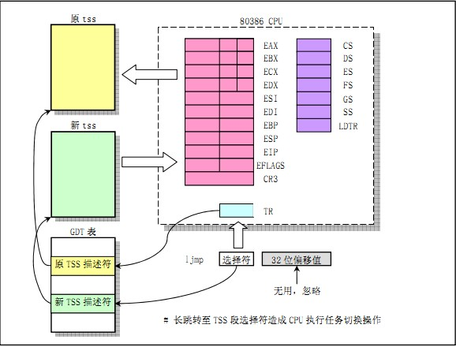

 cpu会把当前寄存器的数据保存到当前（旧的）tr寄存器所指向的tss数据结构里，然后把新的tss数据复制到当前寄存器里。这些操作是通过cpu的硬件实现的


为了调试时能打印出trapframe里面的内容需要修改Makefile，在gcc的选项上加上-g3 

```
-g　　　　  　　　　　　//在编译时生成原生格式的调试符号信息，可以使用 gdb 或 ddx 等调试器调试。-g 分为三个级别，默认为 -g2，其中 -g3 除包含 -g2 中的所有调试信息外，还包含源代码中定义的宏。
```

如下图所示：

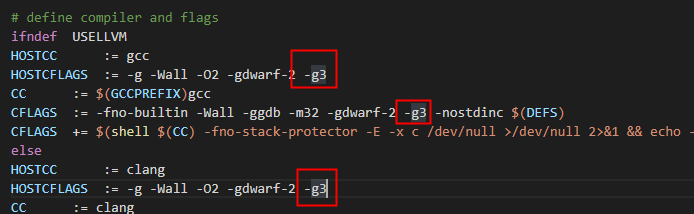


#### 扩展练习 Challenge 2（需要编程）

用键盘实现用户模式内核模式切换。具体目标是：“键盘输入3时切换到用户模式，键盘输入0时切换到内核模式”。 基本思路是借鉴软中断(syscall功能)的代码，并且把trap.c中软中断处理的设置语句拿过来。

做完Challenge 1，Challenge 2基本也就做完了，如下：

```c
    case IRQ_OFFSET + IRQ_KBD:
        c = cons_getc();
        cprintf("kbd [%03d] %c\n", c, c);
		if ( c =='3'){
			switch2user(tf);	
			print_trapframe(tf);
		}
		if ( c =='0'){
			switch2kernel(tf);
			print_trapframe(tf);
		}   		
		break;
```


#### 地址转换

在保护模式下有分段和分页机制，不同的机制地址转换方式有所不同

逻辑地址（Logical Address 应用程序员看到的地址）

物理地址（Physical Address 实际的物理内存地址）

#### 分段机制下的地址转换

可以看到的是段机制下的逻辑地址（logical address）=段选择子(selector）+段偏移（offset）

而找到物理地址（线性地址）的方法是先要根据段选择子从段描述符表中（descriptor table）找到对应的段描述符，然后再加上段偏移（offset）得到线性地址（linear address）在未开启页机制（仅开启段机制）的情况下，此线性地址就是物理地址（实际物理内存地址）

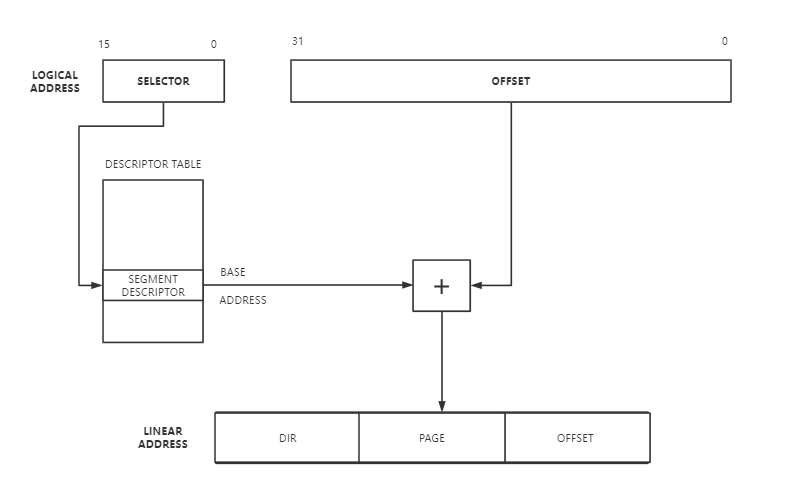


#### 任务状态段（Task State Segment）

用来管理任务的所有信息都被保存在一个特别的段中，任务状态段（TSS）。图7-1 显示了80386的TSS的格式（另一种类型用来执行80286任务，参看第13章）

TSS 状态段由两部分组成：

1、 动态部分，处理器在每次任务切换时会设置这些字段值：

- 通用寄存器（EAX, ECX, EDX, EBX, ESP, EBP, ESI, EDI）。
- 段寄存器（ES，CS，SS，DS，FS，GS）
- 状态寄存器（EFLAGS）
- 指令指针（EIP）
- 前一个执行的任务的TSS段的选择子（只有当要返回时才更新）。

2、 静态字段，处理器读取，但从不更改。这些字段包括：

- 任务的LDT选择子
- 页目录基址寄存器（PDBR）（当启用分页时，只读）
- 内层堆栈指针，特权级0-2
- T-位，指示了处理器在任务切换时是否引发一个调试异常。（关于调试信息，参看第12章）
- I/O 位图基址（关于I/O位图的信息，请参看第8章）

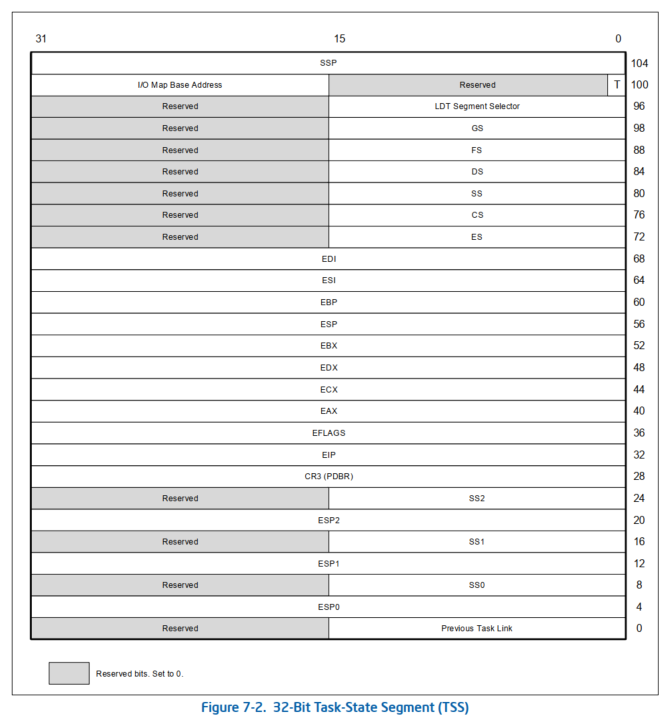

任务状态段可以位于线性地址的任意处。唯一一个要注意的问题是，当TSS跨了一个页的边界时，而且第二个页面又不存在时。在这种情况下，当处理器在任务切换时，读一个TSS如果发现页不存在的话，则引发一个异常。这样的异常可以通过以下两种方法来避免：

1、 把TSS只分配到一个页面中，以使它不跨越页边界。

2、 在任务切换时，保证要么两个页都在内存中，要么都不在内存中。如果两个页面都不在内存中的话，缺页中断处理程序必须在重起用于任务切换的指令前把两页都读入内存中。


7.2 TSS 描述符（TSS Descriptor）

和其它段一样，任务状态段也是用一个描述符来定义的。图7-2显示了TSS描述符的格式。

类型字段中的B-位指出任务是否忙。类型字段为9指出了一个不忙的任务。类型字段为11指出了忙的任务。任务是不可重入的。B-位可以使处理器检测到一个向忙的任务切换的操作。

BASE，LIMIT，DPL，字段和G-位、还有P-位，与其它数据段描述符的作用类似。LIMIT字段，必须大于或等于103。如果在任务切换中，发现任务描述符的界限字段小于103字节的话，处理器引发异常。更大的界限是允许的，如果I/O许可位图存在的话，更大的界限就昌必要的了。如果系统软件想要在TSS中存放额外的数据的话，更大的界限也是可能的。

一个能访问TSS描述符的子程序可以引起任务切换。在大多数系统中，TSS的DPL字段应该设置为0，所以只有最受信任的软件才能做任务切换。

有访问一个TSS的特权，并不意味着可以读或更改TSS。读和更新一个TSS段必须用另一个描述符来重定义成一个数据段。任何想要把TSS描述符加载到一个段寄存器（CS，SS，DS，ES，FS，GS）将产生异常。

TSS描述符只能位于GDT中。如果用一个选择子而且TI=1（指示在当前的LDT内）来标识一个TSS的话将产生一个异常。


### 参考资料

> 一些资料信息来源于 http://pdos.csail.mit.edu/6.828/2014/reference.html

#### search from internet

[ucore lab1 - 不告诉你我是谁 - 博客园 (cnblogs.com)](https://www.cnblogs.com/kongj/p/12507214.html)

[操作系统-uCore-Lab-1](https://yuerer.com/%E6%93%8D%E4%BD%9C%E7%B3%BB%E7%BB%9F-uCore-Lab-1/)

[7.1 任务状态段（Task State Segment） | Intel 80386 程序员参考手册 (gitbooks.io)](https://wizardforcel.gitbooks.io/intel-80386-ref-manual/content/26.html)

[操作系统 uCore Lab 1 含 Challenge](https://yuerer.com/%E6%93%8D%E4%BD%9C%E7%B3%BB%E7%BB%9F-uCore-Lab-1/)

[8086 CPU 寄存器简介 - 小宝马的爸爸 - 博客园 (cnblogs.com)](https://www.cnblogs.com/boyxiao/archive/2010/11/20/1882716.html)

[ucore-analysis/challenge.md at master · oscourse-tsinghua/ucore-analysis · GitHub](https://github.com/oscourse-tsinghua/ucore-analysis/blob/master/labs/lab1/challenge.md)

[ucore lab1及challenge_DynaZang的博客-CSDN博客](https://blog.csdn.net/weixin_43995093/article/details/93190327)

[ucore lab1 - 不告诉你我是谁 - 博客园 (cnblogs.com)](https://www.cnblogs.com/kongj/p/12507214.html)

[ucore lab1 实验报告 · Xris (xr1s.me)](https://xr1s.me/2018/05/15/ucore-lab1-report/#扩展练习_Challenge_1)

[lab1 - ucore step by step (gitbook.io)](https://1790865014.gitbook.io/ucore-step-by-step/intro-10/1_lab1)

[TSS详解 ——《x86汇编语言：从实模式到保护模式》读书笔记33_车子（chezi）-CSDN博客_汇编tss](https://blog.csdn.net/longintchar/article/details/51485179)

[tr 寄存器](https://blog.csdn.net/farmwang/article/details/50088387?utm_medium=distribute.pc_aggpage_search_result.none-task-blog-2~aggregatepage~first_rank_ecpm_v1~rank_v31_ecpm-1-50088387.pc_agg_new_rank&utm_term=TR%E6%AE%B5%E5%AF%84%E5%AD%98%E5%99%A8&spm=1000.2123.3001.4430)

[call指令_百度百科 (baidu.com)](https://baike.baidu.com/item/call指令/6074728)

[iret_百度百科 (baidu.com)](https://baike.baidu.com/item/iret)

[leave（汇编leave指令）_百度百科 (baidu.com)](https://baike.baidu.com/item/leave/9433787#viewPageContent)


#### UNIX general info

- [Youtube Unix intro](https://www.youtube.com/watch?v=tc4ROCJYbm0)
- [The UNIX Time-Sharing System](http://citeseer.ist.psu.edu/10962.html), Dennis M. Ritchie and Ken L.Thompson,. Bell System Technical Journal 57, number 6, part 2 (July-August 1978) pages 1905-1930.
- [The Evolution of the Unix Time-sharing System](http://www.read.seas.harvard.edu/~kohler/class/aosref/ritchie84evolution.pdf), Dennis M. Ritchie, 1979.
- The C programming language (second edition) by Kernighan and Ritchie. Prentice Hall, Inc., 1988. ISBN 0-13-110362-8, 1998.

#### building or reading a small OS

- [How to make an Operating System](https://www.gitbook.com/book/samypesse/how-to-create-an-operating-system/details)
- [xv6 book 中文](https://www.gitbook.com/book/th0ar/xv6-chinese/details)
- [自己动手写操作系统](http://item.jd.com/10142246.html)于渊 著,电子工业出版社,2005
- [Linux-0.11内核完全注释](http://oldlinux.org/download/clk011c-3.0-toc.pdf) 赵炯，2009
- [oldlinux论坛](http://www.oldlinux.org/oldlinux/)
- [osdev.org](http://wiki.osdev.org/Expanded_Main_Page)

#### some OS course

- [6.828: Operating Systems Engineering - in MIT](http://pdos.csail.mit.edu/6.828/2014/index.html)
- [CS-537: Introduction to Operating Systems - in WISC](http://pages.cs.wisc.edu/~remzi/Classes/537/Fall2013/)

#### x86 Emulation

- [QEMU user manual](http://wiki.qemu.org/Qemu-doc.html)

#### x86 Assembly Language

- [Intel 80386 Programmer's Reference Manual, 1987 (HTML).](http://www.logix.cz/michal/doc/i386/)
- [Linux 汇编语言开发指南](http://www.ibm.com/developerworks/cn/linux/l-assembly/index.html)
- [汇编语言程序设计](http://item.jd.com/10057711.html) 布鲁姆 著, 马朝晖 等译,机械工业出版社,2005

#### Multiprocessor references:

- [MP specification](http://pdos.csail.mit.edu/6.828/2014/readings/ia32/MPspec.pdf)
- [IO APIC](http://pdos.csail.mit.edu/6.828/2014/readings/ia32/ioapic.pdf)

#### x86系统结构与编程

- [微型计算机技术及应用（第4版）](http://product.dangdang.com/22915697.html#catalog) 戴梅萼，史嘉权　编著, 清华大学出版社, 2008
- [x86/x64体系探索及编程](http://item.jd.com/11100249.html) 邓志 著，电子工业出版社，2012
- [x86汇编语言：从实模式到保护模式](http://item.jd.com/11179005.html) 李忠，王晓波，余洁 著，电子工业出版社，2013

#### General BIOS and PC bootstrap

- [BIOS Services and Software Interrupts](http://www.htl-steyr.ac.at/~morg/pcinfo/hardware/interrupts/inte1at0.htm), Roger Morgan, 1997.
- ["El Torito" Bootable CD-ROM Format Specification](http://pdos.csail.mit.edu/6.828/2014/readings/boot-cdrom.pdf),Phoenix/IBM, January 1995.

#### VGA display - [console.c](https://github.com/chyyuu/ucore_lab/blob/master/labcodes/lab1/kern/driver/console.c)

- [VESA BIOS Extension (VBE) 3.0](http://web.archive.org/web/20080302090304/http://www.vesa.org/public/VBE/vbe3.pdf) September 1998.
- [Free VGA Project](http://www.osdever.net/FreeVGA/home.htm) J.D. Neal, 1998.

#### 8253/8254 Programmable Interval Timer (PIT)

- [82C54 CHMOS Programmable Interval Timer,](http://www.intel.com/design/archives/periphrl/docs/23124406.htm) , Intel, October 1994.
- [Data Solutions 8253/8254 Tutorial](http://www.decisioncards.com/io/tutorials/8254_tut.html), Data Solutions.

#### 8259/8259A Programmable Interrupt Controller (PIC)

- [8259A Programmable Interrupt Controller](http://pdos.csail.mit.edu/6.828/2014/readings/hardware/8259A.pdf),Intel, December 1988.

#### 16550 UART Serial Port

- [PC16550D Universal Asynchronous Receiver/Transmitter with FIFOs](http://www.national.com/pf/PC/PC16550D.html), National Semiconductor, 1995.
- http://byterunner.com/16550.html, Byterunner Technologies.
- [Interfacing the Serial / RS232 Port,](http://www.beyondlogic.org/serial/serial.htm), Craig Peacock, August 2001.

#### IEEE 1284 Parallel Port

- [Parallel Port Central](http://www.lvr.com/parport.htm), Jan Axelson.
- [Parallel Port Background](http://www.fapo.com/porthist.htm), Warp Nine Engineering.
- [IEEE 1284 - Updating the PC Parallel Port](http://zone.ni.com/devzone/cda/tut/p/id/3466), National Instruments.
- [Interfacing the Standard Parallel Port](http://www.beyondlogic.org/spp/parallel.htm), Craig Peacock, August 2001.

#### IDE hard drive controller

- [AT Attachment with Packet Interface - 6 (working draft)](http://pdos.csail.mit.edu/6.828/2014/readings/hardware/ATA-d1410r3a.pdf), ANSI, December 2001.
- [Programming Interface for Bus Master IDE Controller](http://pdos.csail.mit.edu/6.828/2014/readings/hardware/IDE-BusMaster.pdf), Brad Hosler, Intel, May 1994.
- [The Guide to ATA/ATAPI documentation](http://suif.stanford.edu/~csapuntz/ide.html), Constantine Sapuntzakis, January 2002.


#### make过程日志

通过sudo make V=

make过程打印内容如下：

```
+ cc kern/init/init.c
gcc -Ikern/init/ -fno-builtin -Wall -ggdb -m32 -gstabs -nostdinc  -fno-stack-protector -Ilibs/ -Ikern/debug/ -Ikern/driver/ -Ikern/trap/ -Ikern/mm/ -c kern/init/init.c -o obj/kern/init/init.o
kern/init/init.c:95:1: warning: ‘lab1_switch_test’ defined but not used [-Wunused-function]
   95 | lab1_switch_test(void) {
      | ^~~~~~~~~~~~~~~~
+ cc kern/libs/stdio.c
gcc -Ikern/libs/ -fno-builtin -Wall -ggdb -m32 -gstabs -nostdinc  -fno-stack-protector -Ilibs/ -Ikern/debug/ -Ikern/driver/ -Ikern/trap/ -Ikern/mm/ -c kern/libs/stdio.c -o obj/kern/libs/stdio.o
+ cc kern/libs/readline.c
gcc -Ikern/libs/ -fno-builtin -Wall -ggdb -m32 -gstabs -nostdinc  -fno-stack-protector -Ilibs/ -Ikern/debug/ -Ikern/driver/ -Ikern/trap/ -Ikern/mm/ -c kern/libs/readline.c -o obj/kern/libs/readline.o
+ cc kern/debug/panic.c
gcc -Ikern/debug/ -fno-builtin -Wall -ggdb -m32 -gstabs -nostdinc  -fno-stack-protector -Ilibs/ -Ikern/debug/ -Ikern/driver/ -Ikern/trap/ -Ikern/mm/ -c kern/debug/panic.c -o obj/kern/debug/panic.o
+ cc kern/debug/kdebug.c
gcc -Ikern/debug/ -fno-builtin -Wall -ggdb -m32 -gstabs -nostdinc  -fno-stack-protector -Ilibs/ -Ikern/debug/ -Ikern/driver/ -Ikern/trap/ -Ikern/mm/ -c kern/debug/kdebug.c -o obj/kern/debug/kdebug.o
+ cc kern/debug/kmonitor.c
gcc -Ikern/debug/ -fno-builtin -Wall -ggdb -m32 -gstabs -nostdinc  -fno-stack-protector -Ilibs/ -Ikern/debug/ -Ikern/driver/ -Ikern/trap/ -Ikern/mm/ -c kern/debug/kmonitor.c -o obj/kern/debug/kmonitor.o
+ cc kern/driver/clock.c
gcc -Ikern/driver/ -fno-builtin -Wall -ggdb -m32 -gstabs -nostdinc  -fno-stack-protector -Ilibs/ -Ikern/debug/ -Ikern/driver/ -Ikern/trap/ -Ikern/mm/ -c kern/driver/clock.c -o obj/kern/driver/clock.o
+ cc kern/driver/console.c
gcc -Ikern/driver/ -fno-builtin -Wall -ggdb -m32 -gstabs -nostdinc  -fno-stack-protector -Ilibs/ -Ikern/debug/ -Ikern/driver/ -Ikern/trap/ -Ikern/mm/ -c kern/driver/console.c -o obj/kern/driver/console.o
+ cc kern/driver/picirq.c
gcc -Ikern/driver/ -fno-builtin -Wall -ggdb -m32 -gstabs -nostdinc  -fno-stack-protector -Ilibs/ -Ikern/debug/ -Ikern/driver/ -Ikern/trap/ -Ikern/mm/ -c kern/driver/picirq.c -o obj/kern/driver/picirq.o
+ cc kern/driver/intr.c
gcc -Ikern/driver/ -fno-builtin -Wall -ggdb -m32 -gstabs -nostdinc  -fno-stack-protector -Ilibs/ -Ikern/debug/ -Ikern/driver/ -Ikern/trap/ -Ikern/mm/ -c kern/driver/intr.c -o obj/kern/driver/intr.o
+ cc kern/trap/trap.c
gcc -Ikern/trap/ -fno-builtin -Wall -ggdb -m32 -gstabs -nostdinc  -fno-stack-protector -Ilibs/ -Ikern/debug/ -Ikern/driver/ -Ikern/trap/ -Ikern/mm/ -c kern/trap/trap.c -o obj/kern/trap/trap.o
kern/trap/trap.c: In function ‘print_trapframe’:
kern/trap/trap.c:107:16: warning: taking address of packed member of ‘struct trapframe’ may result in an unaligned pointer value [-Waddress-of-packed-member]
  107 |     print_regs(&tf->tf_regs);
      |                ^~~~~~~~~~~~
+ cc kern/trap/vectors.S
gcc -Ikern/trap/ -fno-builtin -Wall -ggdb -m32 -gstabs -nostdinc  -fno-stack-protector -Ilibs/ -Ikern/debug/ -Ikern/driver/ -Ikern/trap/ -Ikern/mm/ -c kern/trap/vectors.S -o obj/kern/trap/vectors.o
+ cc kern/trap/trapentry.S
gcc -Ikern/trap/ -fno-builtin -Wall -ggdb -m32 -gstabs -nostdinc  -fno-stack-protector -Ilibs/ -Ikern/debug/ -Ikern/driver/ -Ikern/trap/ -Ikern/mm/ -c kern/trap/trapentry.S -o obj/kern/trap/trapentry.o
+ cc kern/mm/pmm.c
gcc -Ikern/mm/ -fno-builtin -Wall -ggdb -m32 -gstabs -nostdinc  -fno-stack-protector -Ilibs/ -Ikern/debug/ -Ikern/driver/ -Ikern/trap/ -Ikern/mm/ -c kern/mm/pmm.c -o obj/kern/mm/pmm.o
+ cc libs/string.c
gcc -Ilibs/ -fno-builtin -Wall -ggdb -m32 -gstabs -nostdinc  -fno-stack-protector -Ilibs/  -c libs/string.c -o obj/libs/string.o
+ cc libs/printfmt.c
gcc -Ilibs/ -fno-builtin -Wall -ggdb -m32 -gstabs -nostdinc  -fno-stack-protector -Ilibs/  -c libs/printfmt.c -o obj/libs/printfmt.o
+ ld bin/kernel
ld -m    elf_i386 -nostdlib -T tools/kernel.ld -o bin/kernel  obj/kern/init/init.o obj/kern/libs/stdio.o obj/kern/libs/readline.o obj/kern/debug/panic.o obj/kern/debug/kdebug.o obj/kern/debug/kmonitor.o obj/kern/driver/clock.o obj/kern/driver/console.o obj/kern/driver/picirq.o obj/kern/driver/intr.o obj/kern/trap/trap.o obj/kern/trap/vectors.o obj/kern/trap/trapentry.o obj/kern/mm/pmm.o  obj/libs/string.o obj/libs/printfmt.o
+ cc boot/bootasm.S
gcc -Iboot/ -fno-builtin -Wall -ggdb -m32 -gstabs -nostdinc  -fno-stack-protector -Ilibs/ -Os -nostdinc -c boot/bootasm.S -o obj/boot/bootasm.o
+ cc boot/bootmain.c
gcc -Iboot/ -fno-builtin -Wall -ggdb -m32 -gstabs -nostdinc  -fno-stack-protector -Ilibs/ -Os -nostdinc -c boot/bootmain.c -o obj/boot/bootmain.o
+ cc tools/sign.c
gcc -Itools/ -g -Wall -O2 -c tools/sign.c -o obj/sign/tools/sign.o
gcc -g -Wall -O2 obj/sign/tools/sign.o -o bin/sign
+ ld bin/bootblock
ld -m    elf_i386 -nostdlib -N -e start -Ttext 0x7C00 obj/boot/bootasm.o obj/boot/bootmain.o -o obj/bootblock.o
'obj/bootblock.out' size: 492 bytes
build 512 bytes boot sector: 'bin/bootblock' success!
dd if=/dev/zero of=bin/ucore.img count=10000
10000+0 records in
10000+0 records out
5120000 bytes (5.1 MB, 4.9 MiB) copied, 0.021646 s, 237 MB/s
dd if=bin/bootblock of=bin/ucore.img conv=notrunc
1+0 records in
1+0 records out
512 bytes copied, 0.000546975 s, 936 kB/s
dd if=bin/kernel of=bin/ucore.img seek=1 conv=notrunc
163+1 records in
163+1 records out
83936 bytes (84 kB, 82 KiB) copied, 0.000939863 s, 89.3 MB/s
```


### 需要再学习理解


#### 实模式下的内存布局

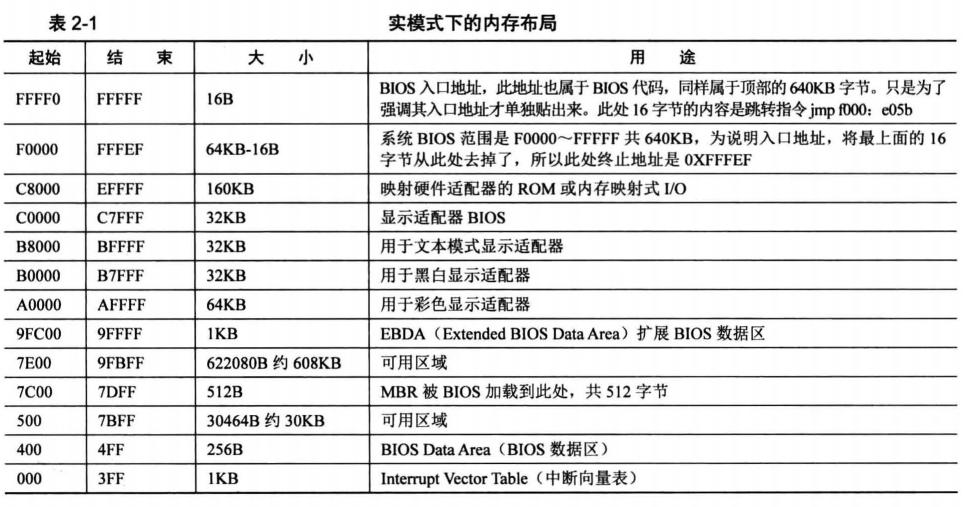


#### 双向循环链表

在“数据结构”课程中，如果创建某种数据结构的双循环链表，通常采用的办法是在这个数据结构的类型定义中有专门的成员变量 data, 并且加入两个指向该类型的指针next和prev。例如：

```
typedef struct foo {
    ElemType data;
    struct foo *prev;
    struct foo *next;
} foo_t;
```

双向循环链表的特点是尾节点的后继指向首节点，且从任意一个节点出发，沿两个方向的任何一个，都能找到链表中的任意一个节点的data数据。由双向循环列表形成的数据链如下所示：


这种双向循环链表数据结构的一个潜在问题是，虽然链表的基本操作是一致的，但由于每种特定数据结构的类型不一致，需要为每种特定数据结构类型定义针对这个数据结构的特定链表插入、删除等各种操作，会导致代码冗余。

在uCore内核（从lab2开始）中使用了大量的双向循环链表结构来组织数据，包括空闲内存块列表、内存页链表、进程列表、设备链表、文件系统列表等的数据组织（在[labX/libs/list.h]实现），但其具体实现借鉴了Linux内核的双向循环链表实现，与“数据结构”课中的链表数据结构不太一样。下面将介绍这一数据结构的设计与操作函数。 uCore的双向链表结构定义为：

```
struct list_entry {
    struct list_entry *prev, *next;
};
```

需要注意uCore内核的链表节点list_entry没有包含传统的data数据域，，而是在具体的数据结构中包含链表节点。以lab2中的空闲内存块列表为例，空闲块链表的头指针定义（位于lab2/kern/mm/memlayout.h中）为：

```
/* free_area_t - maintains a doubly linked list to record free (unused) pages */
typedef struct {
    list_entry_t free_list;         // the list header
    unsigned int nr_free;           // # of free pages in this free list
} free_area_t;
```

而每一个空闲块链表节点定义（位于lab2/kern/mm/memlayout）为：

```
/* *
 * struct Page - Page descriptor structures. Each Page describes one
 * physical page. In kern/mm/pmm.h, you can find lots of useful functions
 * that convert Page to other data types, such as phyical address.
 * */
struct Page {
    atomic_t ref;          // page frame's reference counter
    ……
    list_entry_t page_link;         // free list link
};
```

这样以free_area_t结构的数据为双向循环链表的链表头指针，以Page结构的数据为双向循环链表的链表节点，就可以形成一个完整的双向循环链表，如下图所示：

 图 空闲块双向循环链表

从上图中我们可以看到，这种通用的双向循环链表结构避免了为每个特定数据结构类型定义针对这个数据结构的特定链表的麻烦，而可以让所有的特定数据结构共享通用的链表操作函数。在实现对空闲块链表的管理过程（参见lab2/kern/mm/default_pmm.c）中，就大量使用了通用的链表插入，链表删除等操作函数。有关这些链表操作函数的定义如下。

(1) 初始化

uCore只定义了链表节点，并没有专门定义链表头，那么一个双向循环链表是如何建立起来的呢？让我们来看看list_init这个内联函数（inline funciton）：

```
static inline void
list_init(list_entry_t *elm) {
    elm->prev = elm->next = elm;
}
```

参看文件default_pmm.c的函数default_init，当我们调用list_init(&(free_area.free_list))时，就声明一个名为free_area.free_list的链表头时，它的next、prev指针都初始化为指向自己，这样，我们就有了一个表示空闲内存块链的空链表。而且我们可以用头指针的next是否指向自己来判断此链表是否为空，而这就是内联函数list_empty的实现。

(2) 插入

对链表的插入有两种操作，即在表头插入（list_add_after）或在表尾插入（list_add_before）。因为双向循环链表的链表头的next、prev分别指向链表中的第一个和最后一个节点，所以，list_add_after和list_add_before的实现区别并不大，实际上uCore分别用**list_add(elm, listelm, listelm->next)和**list_add(elm, listelm->prev, listelm)来实现在表头插入和在表尾插入。而__list_add的实现如下：

```
static inline void
__list_add(list_entry_t *elm, list_entry_t *prev, list_entry_t *next) {
    prev->next = next->prev = elm;
    elm->next = next;
    elm->prev = prev;
}
```

从上述实现可以看出在表头插入是插入在listelm之后，即插在链表的最前位置。而在表尾插入是插入在listelm->prev之后，即插在链表的最后位置。注：list_add等于list_add_after。

(3) 删除

当需要删除空闲块链表中的Page结构的链表节点时，可调用内联函数list_del，而list_del进一步调用了__list_del来完成具体的删除操作。其实现为：

```
static inline void
list_del(list_entry_t *listelm) {
    __list_del(listelm->prev, listelm->next);
}
static inline void
__list_del(list_entry_t *prev, list_entry_t *next) {
    prev->next = next;
    next->prev = prev;
}
```

如果要确保被删除的节点listelm不再指向链表中的其他节点，这可以通过调用list_init函数来把listelm的prev、next指针分别自身，即将节点置为空链状态。这可以通过list_del_init函数来完成。

(4) 访问链表节点所在的宿主数据结构

通过上面的描述可知，list_entry_t通用双向循环链表中仅保存了某特定数据结构中链表节点成员变量的地址，那么如何通过这个链表节点成员变量访问到它的所有者（即某特定数据结构的变量）呢？Linux为此提供了针对数据结构XXX的le2XXX(le, member)的宏，其中le，即list entry的简称，是指向数据结构XXX中list_entry_t成员变量的指针，也就是存储在双向循环链表中的节点地址值， member则是XXX数据类型中包含的链表节点的成员变量。例如，我们要遍历访问空闲块链表中所有节点所在的基于Page数据结构的变量，则可以采用如下编程方式（基于lab2/kern/mm/default_pmm.c）：

```
//free_area是空闲块管理结构，free_area.free_list是空闲块链表头
free_area_t free_area;
list_entry_t * le = &free_area.free_list;  //le是空闲块链表头指针
while((le=list_next(le)) != &free_area.free_list) { //从第一个节点开始遍历
    struct Page *p = le2page(le, page_link); //获取节点所在基于Page数据结构的变量
    ……
}
```

le2page宏（定义位于lab2/kern/mm/memlayout.h）的使用相当简单：

```
// convert list entry to page
#define le2page(le, member)                 \
to_struct((le), struct Page, member)
```

而相比之下，它的实现用到的to_struct宏和offsetof宏（定义位于lab2/libs/defs.h）则有一些难懂：

```
/* Return the offset of 'member' relative to the beginning of a struct type */
#define offsetof(type, member)                                      \
((size_t)(&((type *)0)->member))

/* *
 * to_struct - get the struct from a ptr
 * @ptr:    a struct pointer of member
 * @type:   the type of the struct this is embedded in
 * @member: the name of the member within the struct
 * */
#define to_struct(ptr, type, member)                               \
((type *)((char *)(ptr) - offsetof(type, member)))
```

这里采用了一个利用gcc编译器技术的技巧，即先求得数据结构的成员变量在本宿主数据结构中的偏移量，然后根据成员变量的地址反过来得出属主数据结构的变量的地址。

我们首先来看offsetof宏，size_t最终定义与CPU体系结构相关，本实验都采用Intel X86-32 CPU，顾szie_t等价于 unsigned int。 ((type *)0)->member的设计含义是什么？其实这是为了求得数据结构的成员变量在本宿主数据结构中的偏移量。为了达到这个目标，首先将0地址强制"转换"为type数据结构（比如struct Page）的指针，再访问到type数据结构中的member成员（比如page_link）的地址，即是type数据结构中member成员相对于数据结构变量的偏移量。在offsetof宏中，这个member成员的地址（即“&((type *)0)->member)”）实际上就是type数据结构中member成员相对于数据结构变量的偏移量。对于给定一个结构，offsetof(type,member)是一个常量，to_struct宏正是利用这个不变的偏移量来求得链表数据项的变量地址。接下来再分析一下to_struct宏，可以发现 to_struct宏中用到的ptr变量是链表节点的地址，把它减去offsetof宏所获得的数据结构内偏移量，即就得到了包含链表节点的属主数据结构的变量的地址。

